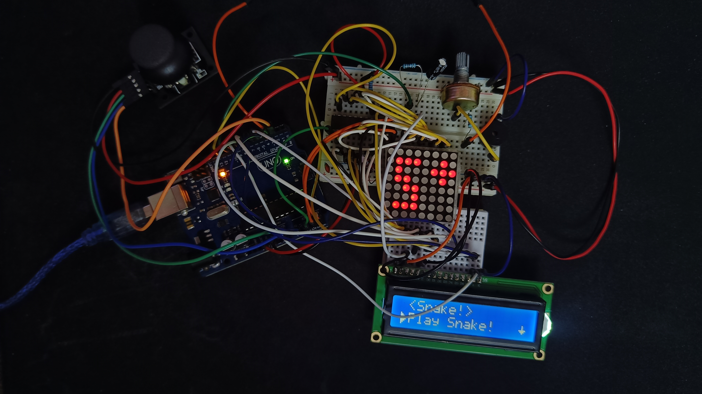

# 🐍 Snake on arduino

## 📒 Description

Project created as part of the "Introduction to Robotics" course I took in the 3rd year at the Faculty of Mathematics and Computer Science, University of Bucharest. The goal was to create an interactive game on the 8x8 led matrix.

## 📖 Backstory

I was inspired to create an arcade game in the style of classic games from the 80s and 90s. I decided to create a Snake-style game because it is a classic game that many people grew up playing. It also brings back nostalgic memories of playing on the iconic Nokia 3310 phone.

## 🕹️ How to play

🐍 You are in an 8x8 grid.\
🐍 Use the joystick to move up, left, down or right. You can't move diagonally. You need to hold the joystick in the direction of your choosing\
🐍 Eat apples to grow and get points. Apples are marked as blinking leds\
🐍 Don't go too long without eating or you will lose lives. You have 3 lives and you can't regenerate them. If you lose all of them due to starvation you lose!\
🐍 Also be careful not to eat yourself or exit the matrix. You will die instantly!\
🐍 The goal is to get the highest score. For this you will need to play on the hardest difficulty and reach the maximum length of the snake available - 64.

## 🔩 Checkout the rest of the technical details in the [technical documentation](https://github.com/george-radu-cs/arduino-snake/wiki/Technical-Documentation)

## 🖼️ Pictures of the setup

## 🎥 Video showcasing the setup

